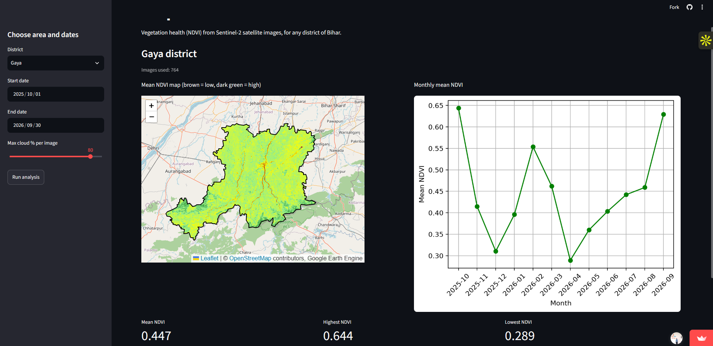

# Crop Health Monitor - Bihar

A web app that shows crop and vegetation health (NDVI) for any district of Bihar, using Sentinel-2 satellite images from Google Earth Engine.

**Live app:** https://bihar-crop-health-monitor-wmvwzdrfueudndxdtu9w8g.streamlit.app/

   

## What the app does

1. You choose a **district** (all districts of Bihar, Gaya is the default), a **start date**, an **end date** and a **cloud limit**.
2. You click **Run analysis**.
3. The app shows:

   * a **map** of the average NDVI for the district (brown = low, dark green = high)
   * a **chart** of the monthly average NDVI
   * the **mean, highest and lowest** NDVI, with the month of each
   * a **table** with the monthly values and the number of images used in each month

## How it works

* Satellite images come from the Sentinel-2 Surface Reflectance collection (`COPERNICUS/S2\_SR\_HARMONIZED`) in Google Earth Engine. Nothing is downloaded, because Earth Engine does the processing.
* Clouds, cloud shadows, cirrus and snow are removed pixel by pixel using the SCL band.
* NDVI is calculated as (B8 - B4) / (B8 + B4), where B8 is near-infrared and B4 is red.
* District boundaries come from the FAO GAUL level 2 dataset.
* The monthly chart is the average NDVI of the whole district for each month.
* The app is written in Python with Streamlit and runs on Streamlit Community Cloud. It logs in to Earth Engine with a service account key stored in Streamlit Secrets (the key is not in this repository).

## Result: Gaya district, Oct 2025 to Sep 2026

The chart shows the two crop seasons of Bihar:

* The lowest NDVI (about 0.29) is in April 2026, after the rabi harvest.
* NDVI rises to a peak in February 2026 (rabi crops) and again from July to September 2026 (kharif crops).
* The highest monthly value (about 0.64) is in October 2025.

## Tools used

Python, Streamlit, Google Earth Engine (Python API), folium, pandas, matplotlib

## Limits

* District boundaries are from the 2015 version of FAO GAUL, which has 37 districts for Bihar. Newer districts and changes after 2015 are not shown, and this dataset is marked as deprecated by Earth Engine.
* In the monsoon months there are many clouds, so fewer clear pixels are available and those months are less certain.
* The monthly values are calculated at a 100 m scale to keep the app fast.
* One run can cover up to 24 months.
* NDVI shows how green the vegetation is. It does not tell the crop type or the yield, and it was not checked against field data.

## Run it on your own computer

1. Install the libraries: `pip install -r requirements.txt`
2. Log in to Earth Engine once: `earthengine authenticate`
3. In `app.py`, change the project ID to your own Earth Engine project.
4. Start the app: `python -m streamlit run app.py`

## Author

Rimjhim Kumari, M.Tech Geoinformatics, NIT Warangal

